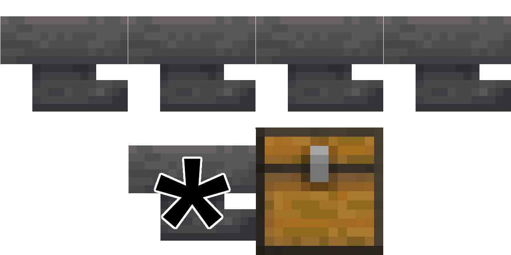

# Gloppers!

Gloppers (**gl**ob h**oppers**) is a Minecraft mod that lets you filter your hoppers by renaming them with glob patterns.

The idea comes from [LiveOverflow's Minecraft lets play](https://www.youtube.com/playlist?list=PLhixgUqwRTjwvBI-hmbZ2rpkAl4lutnJG), where these were silently implemented on his server to make his storage system easier to build.

## Usage

First, install the mod. This mod is serverside only and will do nothing on the client (unless you're in singleplayer).

Once it's installed, rename a hopper in an anvil, prefixing with an exclamation mark. Add globs matching the IDs of the items you want to filter for, separated by commas.

Some example patterns:

- `!*_ore` - Matches all ores
- `!iron_*` - Matches all iron items
- `!totem_of_undying` - Matches only the Totem of Undying
- `!*oak*,*cherry*` - Matches all oak and cherry wood items

Note that you must use the internal identifier of the items, and not the item's display name (e.g. `writable_book` instead of `Book and Quill`). Don't add the namespace (the "minecraft" part).

## Advantages over vanilla

- Only materials required to use are iron and wood (no redstone)
- 1x1x1 footprint, compared to the popular 4x3x1 design
- Ability to filter unstackable items
- No junk items required

## Usage in storage systems

Gloppers are most useful in storage systems. Instead of requiring redstone circuits that take up space, you can instead just design it like so:

Items will only be sucked up from the top row to the bottom glopper if the pattern is matched.
